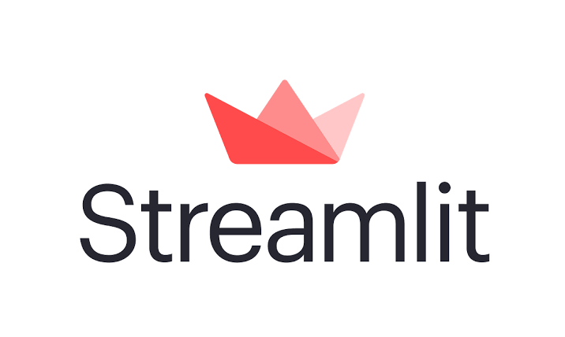
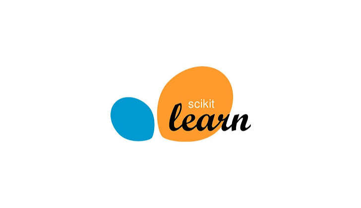

# 📈 StockAI

### 🤖 AI-Powered Stock Market Analysis Platform

**StockAI** is a next-generation stock market analytics engine that unifies **machine learning**, **technical indicators**, **fundamental analysis**, and **algorithmic backtesting** into one fluid, interactive dashboard.

The application simplifies financial research by centralizing complex market data. Users can instantly query a ticker to extract AI-generated directional signals, fundamental financial health metrics, historical strategy performance, and real-time interactive charts.

> [!WARNING]
> StockAI is built strictly for educational purposes and does not constitute financial, investment, or legal advice.

---

## 🚀 Live Demo

### 🔗 **[Launch the Live Dashboard](https://stock-ai-tejasvig05.streamlit.app/)**

<p align="center">
  <!-- TIP: Record a 5-second GIF of your Streamlit app running and drop the image file path here! -->
  
</p>

---

## ✨ Key Features

*   **🤖 Predictive AI Engine:** Generates short-term market directional signals using specialized ML architecture.
*   **📊 Advanced Technicals:** Automates calculations for **SMA, RSI, and MACD** momentum tracking.
*   **🎯 Expected Return Estimator:** Projects short-term expected asset price returns mathematically.
*   **🏢 Fundamental Grading:** Evaluates company health across corporate valuation, profitability, growth trajectories, and operational margins.
*   **📈 Rich Visualizations:** Renders high-fidelity, interactive financial candlestick charts natively.
*   **🧪 Backtesting Engine:** Evaluates algorithmic strategy variants against a baseline Buy & Hold approach.

---

## 🧠 System Architecture

```text
       [ Historical Stock Data ]
                   │
                   ▼
         [ Data Preprocessing ]
                   │
                   ▼
        [ Feature Engineering ]
                   │
                   ▼
     [ Technical Indicator Generation ]
                   │
                   ▼
       [ Machine Learning Models ]
         (LSTM, Prophet, Scikit)
                   │
                   ▼
      [ AI Insights & Signals Engine ]
                   │
                   ▼
     [ Interactive Streamlit UI ]
```

Historical financial data is cleaned and engineered into technical features. These arrays feed downstream statistical and machine learning models to surface directional anomalies and project short-term historical insights.

---

## 🛠️ Tech Stack

<p align="left">
  

  
  
  
  
  
</p>

*   **Modeling & Core:** Scikit-learn, TensorFlow (LSTM), Prophet, NumPy, Pandas
*   **Interface & Graphics:** Streamlit, Plotly Web UI

---

## 💻 Local Installation & Deployment

Clone the core repository:
```bash
git clone https://github.com
cd Stock-AI
python -m venv venv
```

Activate your virtual runtime sandbox:

*   **Windows Subsystem:** `venv\Scripts\activate`
*   **MacOS / Linux Terminal:** `source venv/bin/activate`

Install core dependencies and launch the engine:
```bash
pip install -r requirements.txt
streamlit run dashboard/app.py
```
Your browser should automatically launch `http://localhost:8501`.

---

## 🔮 Roadmap & Future Implementations

*   [ ] Live WebSocket API streaming for real-time order books.
*   [ ] NLP engine for news and corporate sentiment profiling.
*   [ ] Multi-asset portfolio tracking and rebalancing analytics.
*   [ ] Distributed model cloud deployments.

---

## 👩‍💻 Author

Developed with 💻 by **Tejasvi Gupta**. 

If this architecture helped your research, consider leaving a ⭐ on the repository!
